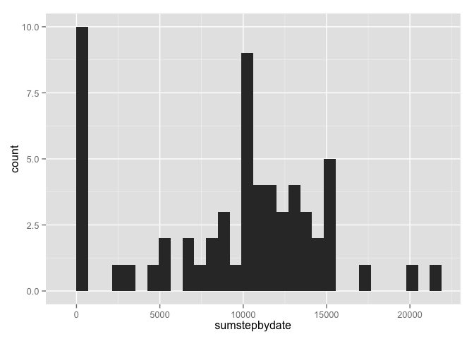
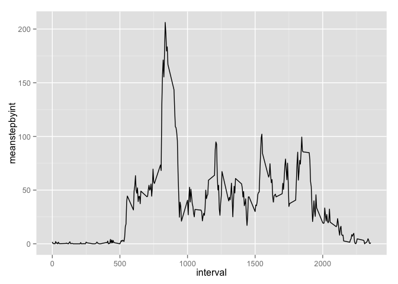
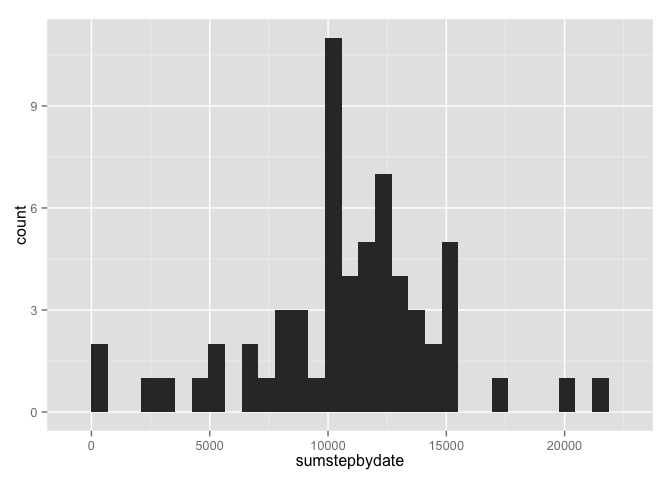
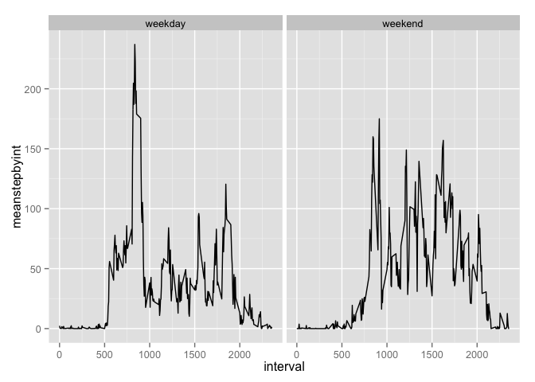
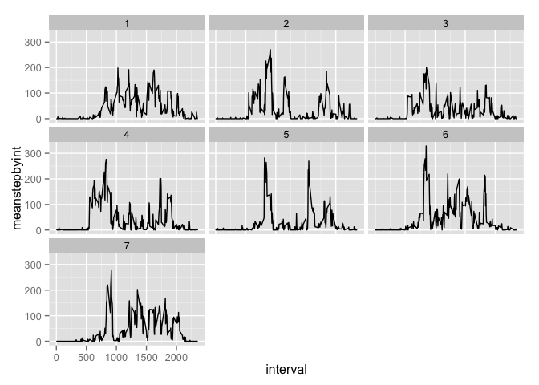

# Reproducible Research: Peer Assessment 1


## Loading and preprocessing the data
I start by loading the data and using `dplyr` functions to organize it in a way that will make following calculations and plots easier to do. I also use `lubridate` to handle the date and time info a little more gracefully. All plots in this report were made with `ggplot2`, so that library is loaded here as well.


```r
library(dplyr)
```

```
## 
## Attaching package: 'dplyr'
## 
## The following object is masked from 'package:stats':
## 
##     filter
## 
## The following objects are masked from 'package:base':
## 
##     intersect, setdiff, setequal, union
```

```r
library(lubridate)
library(ggplot2)

#load data to a data frame
dfraw <- read.csv("./activity.csv")

#create a tbl_df to manipulate with dplyr
tdfraw <- tbl_df(dfraw)
rm(dfraw)

#mutate data as needed to make it easier to work with
tdf1 <- transmute(tdfraw, date=ymd(date), interval, steps)

createweekendfactor <- function(wdayints){
    #create empty container for char vector
	charout <- character(length(wdayints))
	#get weekend and weekday values
	weekdayind <- which(wdayints>1 & wdayints<7)
	weekendind <- which(wdayints==1 | wdayints==7)
	#assign values
	charout[weekdayind] <- 'weekday'
	charout[weekendind] <- 'weekend'
	
	return(as.factor(charout))
}

tdf <- mutate(tdf1, 
	dayofweek = wday(date), 
	partofweek = createweekendfactor(dayofweek))
rm(tdf1)

#create some useful grouped data sets
tdf_bydate <- group_by(tdf, date)
tdf_byday <- group_by(tdf, dayofweek)
tdf_bydayint <- group_by(tdf, dayofweek, interval)
tdf_bypartint <- group_by(tdf, partofweek, interval)
tdf_byint <- group_by(tdf, interval)

#create mean and median data from grouped data
ms_bydate <- summarise(tdf_bydate,
	meanstepbyint=mean(steps, na.rm=T),
	sumstepbydate=sum(steps, na.rm=T))
	 
ms_byint <- summarise(tdf_byint,
	meanstepbyint=mean(steps, na.rm=T),
	sumstepbyint=sum(steps, na.rm=T))
	
m_bydayint <- summarise(tdf_bydayint,
	meanstepbyint = mean(steps, na.rm=T))
```


## What is mean total number of steps taken per day?
Start with s simple histogram of the sum of steps taken each day, NA values have been ignored in these calculations.


```r
histsumbydate <- ggplot(data=ms_bydate, aes(x=sumstepbydate))
histsumbydate + geom_histogram()
```

```
## stat_bin: binwidth defaulted to range/30. Use 'binwidth = x' to adjust this.
```

 

Next for the mean and median calculations. And let's look at the head of the summarisedata as well.


```r
meansumperday <- mean(ms_bydate$sumstepbydate, na.rm=T)
medsumperday <- median(ms_bydate$sumstepbydate, na.rm=T)
ms_bydate
```

```
## Source: local data frame [61 x 3]
## 
##          date meanstepbyint sumstepbydate
## 1  2012-10-01            NA             0
## 2  2012-10-02       0.43750           126
## 3  2012-10-03      39.41667         11352
## 4  2012-10-04      42.06944         12116
## 5  2012-10-05      46.15972         13294
## 6  2012-10-06      53.54167         15420
## 7  2012-10-07      38.24653         11015
## 8  2012-10-08           NaN             0
## 9  2012-10-09      44.48264         12811
## 10 2012-10-10      34.37500          9900
## ..        ...           ...           ...
```

The mean is 9354.2295082 and the median is 10395. Again, NA values have been removed for these calculations.

## What is the average daily activity pattern?
Start with a line graph to get an idea of what the data looks like for each interval, on average across all the days. NA values have been removed in these calculations.


```r
linebyint <- ggplot(data=ms_byint)
linebyint + geom_line(aes(x=interval, y=meanstepbyint))
```

 

Let's also take a look at a sample of the summarised data and calculate the max value.


```r
maxstepint <- max(ms_byint$meanstepbyint, na.rm=T)
ms_byint
```

```
## Source: local data frame [288 x 3]
## 
##    interval meanstepbyint sumstepbyint
## 1         0     1.7169811           91
## 2         5     0.3396226           18
## 3        10     0.1320755            7
## 4        15     0.1509434            8
## 5        20     0.0754717            4
## 6        25     2.0943396          111
## 7        30     0.5283019           28
## 8        35     0.8679245           46
## 9        40     0.0000000            0
## 10       45     1.4716981           78
## ..      ...           ...          ...
```

And here is the data arranged in descending order of average steps per interval.


```r
arrange(ms_byint, desc(meanstepbyint))
```

```
## Source: local data frame [288 x 3]
## 
##    interval meanstepbyint sumstepbyint
## 1       835      206.1698        10927
## 2       840      195.9245        10384
## 3       850      183.3962         9720
## 4       845      179.5660         9517
## 5       830      177.3019         9397
## 6       820      171.1509         9071
## 7       855      167.0189         8852
## 8       815      157.5283         8349
## 9       825      155.3962         8236
## 10      900      143.4528         7603
## ..      ...           ...          ...
```

The max value is 206.1698113. NA values obviously being ignored.


## Imputing missing values
To fill in the NA values we've been ignoring, let's use the average for that day of the week and that interval. The following code accomplishes that:


```r
tdfnaind <- which(is.na(tdf$steps))
num_na <- length(tdfnaind)

#create a copy to add imputed values to
imptdf <- tdf

for (ind in tdfnaind) {
    #find the average for this day of week and this interval
	crnt_day <- tdf[[ind, 'dayofweek']]
	crnt_int <- tdf[[ind, 'interval']]
	crnt_dayintavg <- filter(m_bydayint, 
		dayofweek==crnt_day, interval==crnt_int)[[1, 'meanstepbyint']]
		
	#add value to new data frame
	imptdf[ind, 'steps'] <- crnt_dayintavg
}
```

And let's also recreate the same useful grouped data sets that we did for the previous data frame.

```r
#create some useful grouped data sets with imputed data
imptdf_bydate <- group_by(imptdf, date)
imptdf_bydayint <- group_by(imptdf, dayofweek, interval)
imptdf_bypartint <- group_by(imptdf, partofweek, interval)
imptdf_byint <- group_by(imptdf, interval)

#create mean and median data from grouped data
msimp_bydate <- summarise(imptdf_bydate,
    meanstepbyint=mean(steps, na.rm=T),
	sumstepbydate=sum(steps, na.rm=T))
	 
msimp_byint <- summarise(imptdf_byint,
	meanstepbyint=mean(steps, na.rm=T),
	sumstepbyint=sum(steps, na.rm=T))
	
mimp_bydayint <- summarise(imptdf_bydayint,
	meanstepbyint = mean(steps, na.rm=T))
	
mimp_bypartint <- summarise(imptdf_bypartint,
	meanstepbyint = mean(steps, na.rm=T))
```

Finally let's look at the data and calculate some useful summary statistics.


```r
msimp_bydate
```

```
## Source: local data frame [61 x 3]
## 
##          date meanstepbyint sumstepbydate
## 1  2012-10-01      34.63492      9974.857
## 2  2012-10-02       0.43750       126.000
## 3  2012-10-03      39.41667     11352.000
## 4  2012-10-04      42.06944     12116.000
## 5  2012-10-05      46.15972     13294.000
## 6  2012-10-06      53.54167     15420.000
## 7  2012-10-07      38.24653     11015.000
## 8  2012-10-08      34.63492      9974.857
## 9  2012-10-09      44.48264     12811.000
## 10 2012-10-10      34.37500      9900.000
## ..        ...           ...           ...
```

```r
histimpsumbydate <- ggplot(data=msimp_bydate, aes(x=sumstepbydate))
histimpsumbydate + geom_histogram()
```

```
## stat_bin: binwidth defaulted to range/30. Use 'binwidth = x' to adjust this.
```

 

```r
meanimpsumperday <- mean(msimp_bydate$sumstepbydate)
medimpsumperday <- median(msimp_bydate$sumstepbydate)
maximpstepint <- max(msimp_byint$meanstepbyint)
```

With a new mean of 1.082121\times 10^{4} and median 1.1015\times 10^{4}, compared with a mean of 9354.2295082 and median of 10395, imputing has clearly had the effect of adding steps, as we would expect since NA's were essentially treated as zeros before. Judging by the histogram it has also obviously reduced the number of very low step days, most of those being previously days without data.

## Are there differences in activity patterns between weekdays and weekends?
Let's take a quick look at differences between days graphically. First with a plot of weekdays vs weekends:


```r
linebyintpart <- ggplot(data=mimp_bypartint, aes(x=interval, y=meanstepbyint))
linebyintpart + geom_line() + facet_wrap(~partofweek)
```

 

And also for a little more granularity by days of the week. Sunday is 1, Monday is 2, etc...


```r
scatbyintday <- ggplot(data=m_bydayint, aes(x=interval, y=meanstepbyint))
scatbyintday + geom_line() + facet_wrap(~dayofweek)
```

 

There does seem to be fairly large differences based on the time of the week judging from these plots.
